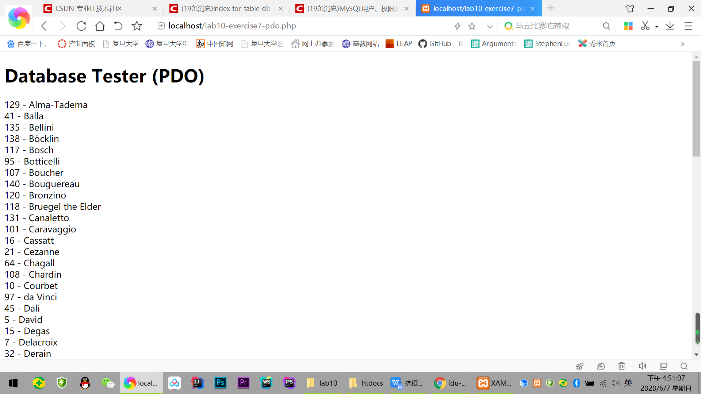
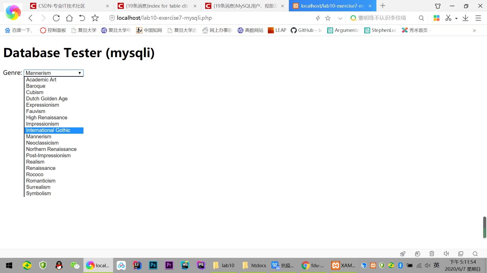
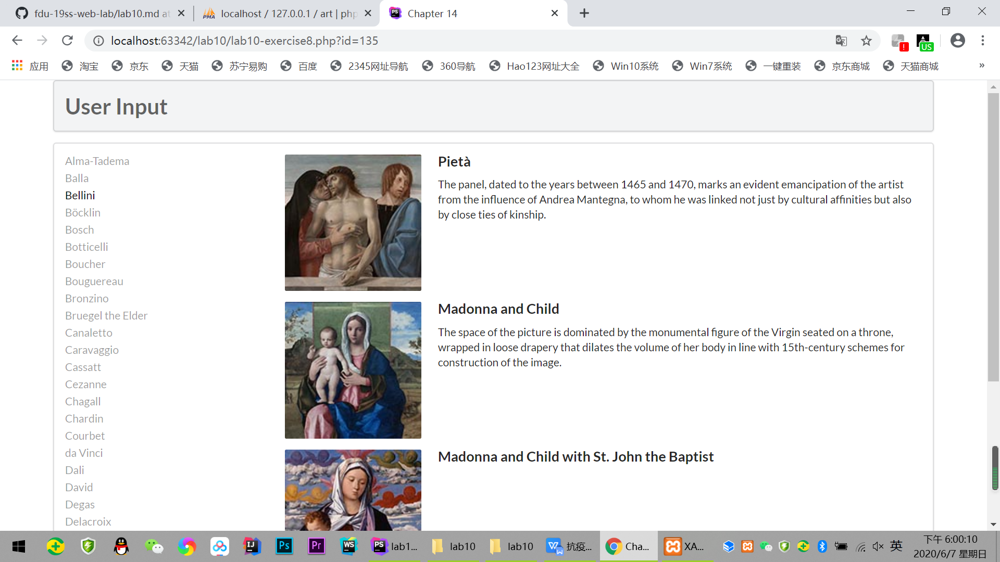

# Lab10 文档

 
## Exercise7: MYSQL THROUGH PHP ：两种访问数据库的方式

**方法一 ： pdo **

`$pdo = new PDO(DBCONNSTRING,DBUSER,DBPASS)` 连接数据库

`setAttribute()`设置属性 ,ATTR_ERRMODE：错误报告,ERRMODE_EXCEPTION: 抛出异常

设置查询，返回结果集；进入循环，获得数据，输出内容

最后释放资源，断开数据库连接

 

**方法二 ： mysqli(面向过程风格)**

使用`mysql_connect()`生成连接到MySQL服务器的链接，获得数据库资源，`if ( mysqli_connect_errno() )`检查确认连接的结果。

`$sql`是一段sql查询语句，接着使用`mysqli_fetch_assoc()`返回相应的数据数组（如果结果集中没有更多的行则返回 null）

使用循环依次生成一段的<option>的html标签，即下拉菜单中的不同选项

循环结束后，释放结果集，`mysqli_close($connection)`断开数据库链接

 

## Exercise8: INTEGRATING USER INPUTS (PDO)  

1. outputArtists()

   通过PDO连接Artists数据库，限制获取30行数据，通过if判断改变其class名。（判断是否为选中条目，若为选中条目则有不同效果）
   在循环中输出每一行的LastName，并设置a标签的各项属性。释放资源，断开数据库连接。
   
2. outputPaintings()

   通过PDO连接Paintings数据库，通过点击获得的id名称获取数据，进入循环，
   执行outputSinglePainting方法，释放资源，断开数据库连接。
   
3. outputSinglePainting($row)

   此方法通过获得的$row数据，依次输出数组中的照片名称，标题与介绍；
   同时输出
<h4>等标签保持html页面规整显示。
   
   

## Exercise9: PREPARED STATEMENTS  

**执行sql语句的方式**

1. executeQuery

用于产生单个结果集（ResultSet）的语句，例如 SELECT 语句。
这是被使用最多的执行 SQL 语句的方法。
但只能执行查询语句，执行后返回代表查询结果的ResultSet对象。

2. executeUpdate

用于执行 INSERT、UPDATE 或 DELETE 语句以及 SQL DDL（数据定义语言）语句，
executeUpdate 的返回值是一个整数（int），指示受影响的行数（即更新计数）。
对于 CREATE TABLE 或 DROP TABLE 等不操作行的语句，executeUpdate 的返回值总为零。

3. execute

可用于执行任何SQL语句，返回一个boolean值，表明执行该SQL语句是否返回了ResultSet。
如果执行后第一个结果是ResultSet，则返回true，否则返回false。
通常没有必要使用execute方法来执行SQL语句，而是使用executeQuery或executeUpdate更适合，但如果在不清楚SQL语句的类型时则只能使用execute方法来执行该SQL语句了。

**prepared statement 的好处**

1. 执行效率：Statement 采取直接编译 SQL 语句的方式，交给数据库去执行，而 PreparedStatement 则先将 SQL 语句预编译一遍，数据库无需再进行编译，效率较高。

2. 可读性：PreparedStatement 无须拼接 SQL 语句，编程简单，可读性高

3. 安全性：Statement 由于可能需要采取字符串与变量的拼接，很容易进行 SQL 注入攻击，而 PreparedStatement 由于是预编译，再填充参数，不存在 SQL 注入问题。 

   

   

