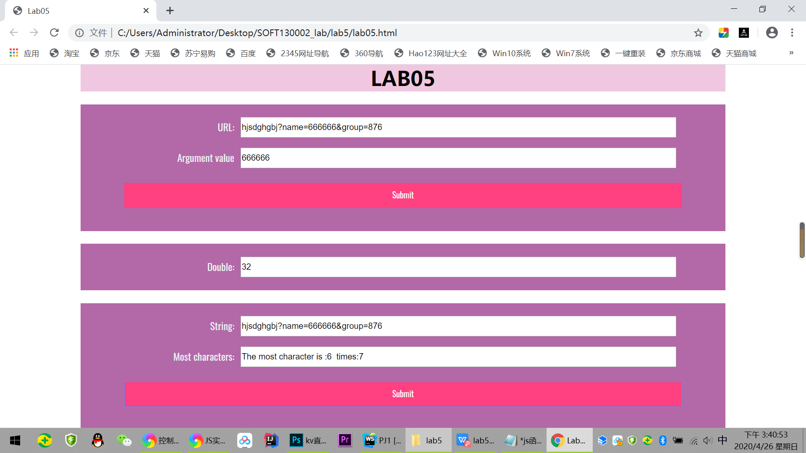
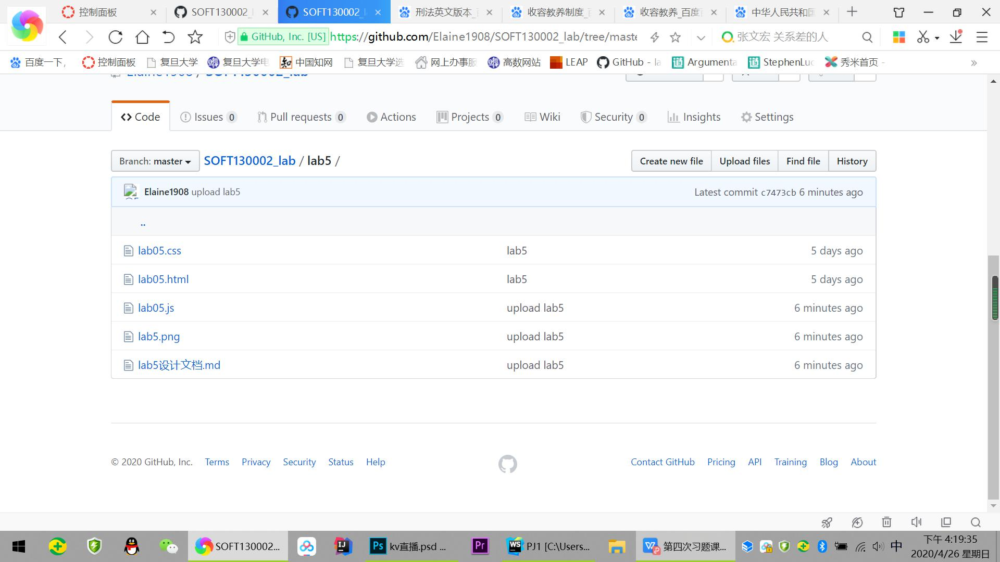

# Lab5设计文档

## url提取参数

首先通过`.split('?')`将url字符串拆分为两部分；再次对后一部分使用`.split('&')`使其拆分为参数名值对。 
用for循环判断是否存在name参数：若存在，则将等号后面的部分赋值给变量name；若不存在，则变量name的值为0。 
最后将变量name赋值给url_result.value.

## 间隔5秒运行函数

使用`window.setInterval("timeTest()",5000)`实现间隔5000毫秒(即5秒) 运行一次timeTest()函数. 
在timeTest()中判断若次数超过10次或者此刻的秒数大于55，则用`window.clearInterval(interval)`停止每隔5秒运行该函数

>new Date().getSeconds() 获取当时的秒数 0-59

>一个错误做法：

    num = 1;
    mul.value = 1;
    let count = 0;
    function timeTest(){
    while(true){
            sleep(5000);
            num *= 2;
            count++;
            mul.value = num;
            if(count >= 10 ||  60 - new Date().getSeconds() < 5) 
            break;
        }
    }
    function sleep(numberMillis) {
        var now = new Date();
        var exitTime = now.getTime() + numberMillis;
        while (true) {
            now = new Date();
            if (now.getTime() > exitTime)
                break;
        }
    }
 >此处因为while循环的原因，timeTest函数只有到了运行完10次或者整点时才会真正结束，而不是每隔5秒更新一次

## 获取出现次数最多的字符

构造数组对象o，char就是对象o的一个属性，o[char]是属性值，存储出现的次数，
如果char属性存在，属性值+1；char属性不存在，则记为1（即字符第一次出现），
使用for循环找到属性值最大值。

## github&网站截图

