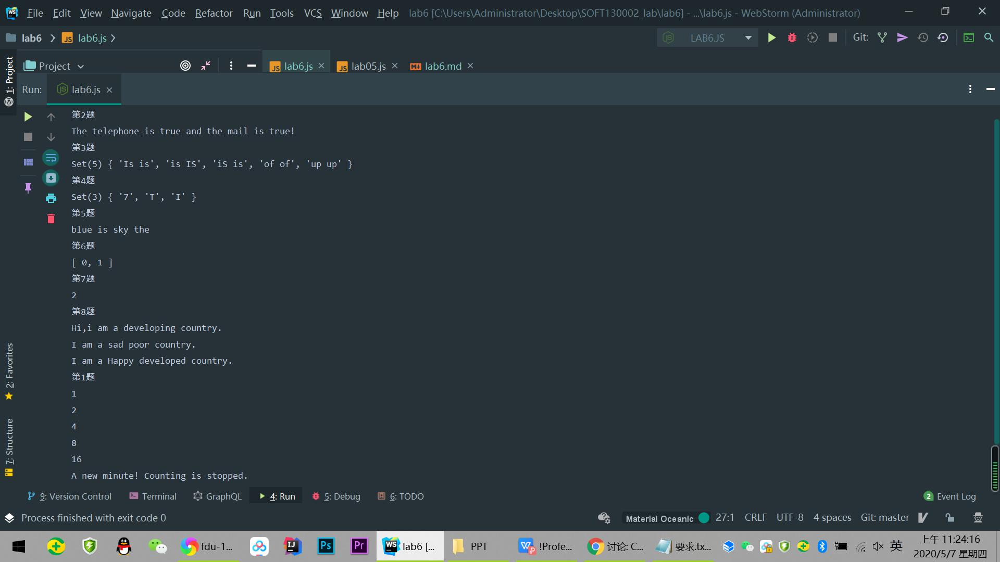
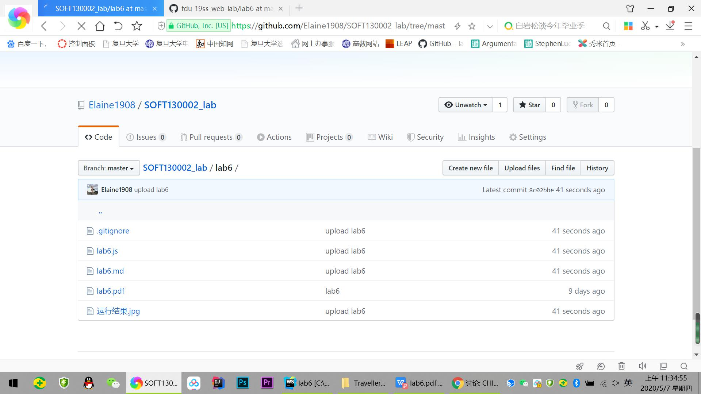

# Lab6文档

## 正则表达式解释

 1.testMail : 邮箱以数字或字母开头，中间是多个数字字母下划线横杠，然后是@接着数字字母，最后一个小数点后以2-4位字母结尾
 ；电话号码是以1开头，第二个数字为3-9中一个，后9位为任意数字的数字串.
 
 2.testRedundancy : 运用正则表达式构造函数`new RegExp(string[i], "i")`创建对一个单词忽略大小写的正则表达式。
 再用for循环遍历字符串，判断`pattern.test(string[i + 1])`一一寻找相同的单词.
 
 
 
 
## Map、Set、Array之间的区别和使用

**Array:**

使用单独的变量名来存储一系列的值,不必每一个下标都有对应的值。

数组的操作方法较为多样灵活(如 join()在各个元素之间插入指定字符，split()切割数组，reverse()使数组倒序排布等)

**Map:**

类似于对象，也是键值对的集合，但是“键”的范围不限于字符串，各种类型的值（包括对象）都可以当作键。Map 结构提供了“值—值”的对应。

size： 返回 Map 结构的成员总数；

set(key,value)设置键名key对应的键值为value，然后返回整个 Map。如果key已经有值，则键值会被更新，否则就新生成该键

get(key)读取key对应的键值，如果找不到key，返回undefined

has(key)返回一个布尔值，表示某个键对应的值是否在当前 Map 对象之中

delete(key)删除某个值；clear()清除所有成员。

**Set：**

类似于数组，但是成员的值都是唯一的，没有重复的值。Set函数可以接受一个数组（或者具有 iterable 接口的其他数据结构）作为参数，用来初始化。

size属性/has()/clear()方法与map相同

add(value)添加某个值，返回 Set

## 继承不同方式的理解

**构造函数继承：**

使用call()方法，实际上是在新创建的子类实例的环境下调用了父类的构造函数，使得子类实例成为一个副本。
然而，方法都在构造函数中定义，无法做到复用；父类原型上定义的方法对子类也不可见。

**原型链继承：**

子类的原型对象是父类的实例，从而子类的原型对象中拥有父类构造函数中定义的实例属性和方法。
（但没有父类原型中定义的方法）由于包含引用类型值的原型属性会被所有实例共享，所以当实例修改引用类型时，原型中的属性也会被修改。

**原型式继承:**

与原型链继承有些类似，即借助原型基于已有的对象创建新的子类对象实例，通过Object.create()对传入其中的对象进行潜复制.
(在寄生组合式继承中，Object.create()试图扩展的是原型)
同样，包含引用类型值的属性始终共享相应的值，所以当实例修改引用类型时，原型中的属性也会被修改。

## 截图

运行结果

github截图

